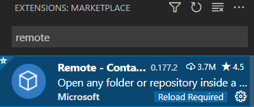
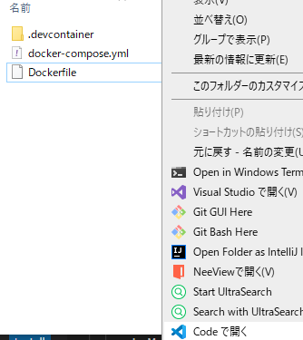
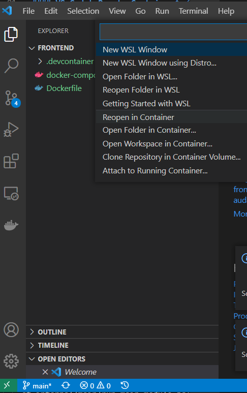

# はじめに

React + Typescriptの開発環境を構築する。ローカルの環境を汚したくない、共同開発者と環境を共有したいという理由で、docker上に開発環境を構築する。


### dockerfile

```docker
# 開発環境
# React + Typescript

# https://hub.docker.com/_/node
FROM node:16-slim

ENV LANG=C.UTF-8
ENV TZ=Asia/Tokyo


# ワーキングを以下の通り作成
ENV bubbloom_frontend_dir = /usr/bubbloom/frontend
RUN mkdir -p ${bubbloom_frontend_dir}

WORKDIR ${bubbloom_frontend_dir}

# reactに必要な依存パッケージをインストール
# create-react-appで最新の依存パッケージが入る。作成されたテンプレートは不要なので削除。
RUN npx create-react-app my-app --template typescript
RUN rm -rf my-app
```

メモ  
最後2行でReact + TypeScript関係の**最新の依存パッケージ**を入れている。プロジェクトを作成したときの依存パッケージを入れたかったが方法がわからなかった。とりあえずヨシ。


### docker-compose

```docker
version: '3'

services: 
  frontend: 
    build: .
    environment: 
      - NODE_ENV=development
    #volumes: 
      # - ./:/usr/src/sample-app
    #command: sh -c 'cd frontend && yarn start'
    ports: 
      - '3000:3000'
    tty: true
```

*build:*  dockerfileの場所を指定  
*environment:*  よくわからない  
*volumes:* ローカルのディレクトリ:docker内のディレクトリをマウント。今回は使用しないが使いたくなったときのためにコメントとして残す。  
*command:*  実行時にコマンドを実行できる。  
*port:* dockerのポートを指定。デフォルトで3000:3000。  
*tty:*   trueでコンテナを永続化。trueにしないとポート待受などをしてないコンテナはすぐ終了する。


### dockerコマンド
*docker ps* 起動中のイメージ情報を取得できる
*docker exec -it コンテナ名 /bin/bash* 起動中のコンテナに入ることができる。dockerfileができ上がるまではよく使う。


### dockerfile変更の反映

*docker-compose up --build* を実施


### ローカルのVS Codeからコンテナ内で開発する

#### VS CodeにRemote-Containerをインストール



#### dockerfile, docker-compose.yamlのあるフォルダを開く



#### VS Codeの左下の[><]をクリックし、Reopen in Containerを選択

これでDockerが自動で起動し、起動したコンテナの中をVS Codeが編集できるようになる。



#### Tips

* ターミナルを起動 → Ctr + @
* サンプルのReact + Typescriptアプリ my-app作成済み
* アプリ起動方法 cd my-app, npm  startで自動でブラウザが起動しindexが表示される
* 初期のワークスペースはusr/bubbloom/frontend